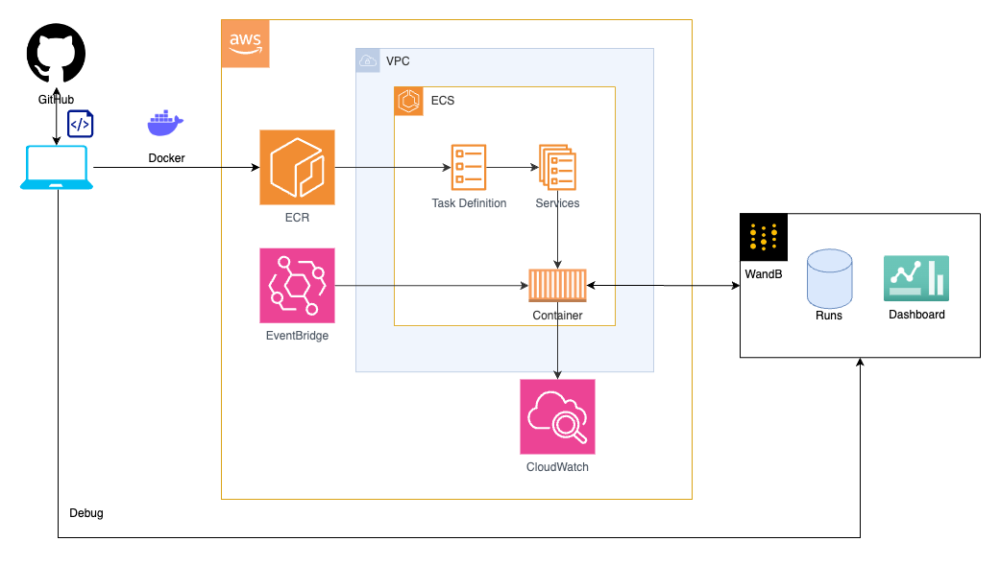

# gpu-dashboard
This repository contains tools for tracking GPU usage and generating dashboards.

## Main Features
1. Collect GPU usage data from multiple companies and projects
2. Generate daily, weekly, monthly, and all-time GPU usage reports
3. Update dashboards using Weights & Biases (wandb)
4. Detect and alert on abnormal GPU usage rates

## Architecture


## Directory Structure of this Repository
```
.
├── Dockerfile.check_dashboard
├── Dockerfile.main
├── README.md
├── config.yaml
├── main.py
├── requirements.txt
├── src
│   ├── alart
│   │   └── check_dashboard.py
│   ├── calculator
│   │   ├── blank_table.py
│   │   ├── gpu_usage_calculator.py
│   │   └── remove_tags.py
│   ├── tracker
│   │   ├── config_parser.py
│   │   └── run_manager.py
│   ├── uploader
│   │   ├── artifact_handler.py
│   │   ├── data_processor.py
│   │   └── run_uploader.py
│   └── utils
│       └── config.py
└── image
    └── gpu-dashboard.drawio.png
```

## Local Environment Setup
In the gpu-dashboard directory, run the following commands:
```
$ python3 -m venv .venv
$ . .venv/bin/activate
$ pip install -r requirements.txt
```

## AWS Environment Setup
### Account Creation and Permission Assignment
Request an AWS account from the administrator and assign access permissions to the following services in IAM:
- AWSBatch
- CloudWatch
- EC2
- ECS
- ECR
- EventBridge
- IAM
- VPC

### AWS CLI Configuration
Create a user for AWS CLI in IAM. Assign access permissions to the following service:
- ECR

Click on the created user and note down the following strings from the Access Keys tab:
- Access key ID
- Secret access key
  
Run the following command in your local Terminal to log in to AWS:

```shell
$ aws configure

AWS Access Key ID [None]: Access key ID
# Enter
AWS Secret Access Key [None]: Secret access key
# Enter
Default region name [None]: Leave blank
# Enter
Default output format [None]: Leave blank
# Enter
```

After configuration, check the connection with the following command. If successful, it will output the list of S3 files:
```shell
$ aws s3 ls
```
Reference: [AWS CLI Setup Tutorial](https://zenn.dev/akkie1030/articles/aws-cli-setup-tutorial)

## Deploying the Scheduled Program
### ECR
#### Creating a Repository
- Navigate to `Amazon ECR > Private registry > Repositories`
- Click `Create repository`
- Enter a repository name (e.g., geniac-gpu)
- Click `Create repository`
#### Pushing Images
- Click on the created repository name
- Click `View push commands`
- Execute the four displayed commands in order in your local Terminal

```bash
# Example commands
$ aws ecr get-login-password --region ap-northeast-1 | docker login --username AWS --password-stdin 111122223333.dkr.ecr.ap-northeast-1.amazonaws.com
$ docker build -t geniac-gpu .
$ docker tag geniac-gpu:latest 111122223333.dkr.ecr.ap-northeast-1.amazonaws.com/geniac-gpu:latest
$ docker push 111122223333.dkr.ecr.ap-northeast-1.amazonaws.com/geniac-gpu:latest
```
> As the commands are unique to each repository, you can easily deploy from the second time onwards by writing these commands in a shell script

Create repositories for both `gpu-dashboard` and `check-dashboard` following the above steps

### VPC
- Navigate to `Virtual Private Cloud > Your VPCs`
- Click `Create VPC`
- Select `VPC and more` from `Resources to create`
- Click `Create VPC`

### IAM
- Navigate to `IAM > Roles`
- Click `Create role`
- Set up the `Use case`:
    - Select `Elastic Container Service` for `Service`
    - Select `Elastic Container Service Task` for `Use case`
- Select `AmazonEC2ContainerRegistryReadOnly` and `CloudWatchLogsFullAccess` for `Permission policies`
- Click `Next`
- Enter `ecsTaskExecutionRole` for `Role name`
- Click `Create role`

### ECS
#### Create Cluster
- Navigate to `Amazon Elastic Container Service > Clusters`
- Click `Create Cluster`
- Enter a cluster name
- Click `Create`

#### Task Definition
- Navigate to `Amazon Elastic Container Service > Task Definitions`
- Click `Create new Task Definition`, then click `Create new Task Definition`
- Enter a task definition family name
- Change `CPU` and `Memory` in `Task size` as needed
- Select `ecsTaskExecutionRole` for `Task role`
- Set up `Container - 1`:
    - Enter the repository name and image URI pushed to ECR in `Container details`
    - Set `Resource allocation limits` appropriately according to `Task size`
- Click `Add environment variable` in `Environment variables - optional` and add the following:
    - Key: WANDB_API_KEY
    - Value: {Your WANDB_API_KEY}
- Click `Create`

#### Create Task
- Navigate to `Amazon Elastic Container Service > Clusters > {Cluster Name} > Scheduled Tasks`
- Click `Create`
- Enter a rule name for `Scheduled rule name`
- Select `cron expression` for `Scheduled rule type`
- Enter an appropriate expression in `cron expression`
    - Note that in this UI, you need to enter UTC time, so `cron(15 15 * * ? *)` would be 0:15 AM Japan time
- Enter a target ID for `Target ID`
- Select the task definition from `Task Definition family`
- Select VPC and subnets in `Networking`
- If there's no existing security group in `Security group`, select `Create a new security group` and create one
- Click `Create`

## Debugging
### Local Environment Setup
Execute the following commands to set up a local Python environment for running the scheduled script.
You can edit `config.yaml` to minimize impact on the production environment.

```shell
$ cd gpu-dashboard
$ python3 -m venv .venv
$ . .venv/bin/activate
```

### Usage
#### Running the Main Script
```shell
python main.py [--api WANDB_API_KEY] [--start-date YYYY-MM-DD] [--end-date YYYY-MM-DD]
```
--api: wandb API key (optional, can be set as an environment variable)
--start-date: Data retrieval start date (optional)
--end-date: Data retrieval end date (optional)

#### Checking Dashboard Health
```shell
python src/alart/check_dashboard.py
```

### Main Components
- src/tracker/: GPU usage data collection
- src/calculator/: GPU usage statistics calculation
- src/uploader/: Data upload to wandb
- src/alart/: Anomaly detection and alert functionality

### How to Check Logs
- In AWS, navigate to `CloudWatch > Log groups`
- Click on `/ecs/{task definition name}`
- Click on the log stream to view logs

## Appendix
### Program Processing Steps
- Fetch latest data (src/tracker/)
    - Set start_date and end_date
        - If unspecified, both values default to yesterday's date
    - Create a list of companies
    - Fetch projects for each company [Public API]
    - Fetch runs for each project [Private API]
        - Filter by target_date, tags
    - Detect and alert runs that initialize wandb multiple times on the same instance
    - Fetch system metrics for each run [Public API]
    - Aggregate by run id x date
- Update data (src/uploader/)
    - Retrieve csv up to yesterday from Artifacts
    - Concatenate with the latest data and save to Artifacts
    - Filter run ids
- Aggregate and update data (src/calculator)
    - Remove latest tag
    - Aggregate retrieved data
        - Aggregate overall data
        - Aggregate monthly data
        - Aggregate weekly data
        - Aggregate daily data
        - Aggregate summary data
    - Update overall table
    - Update tables for each company